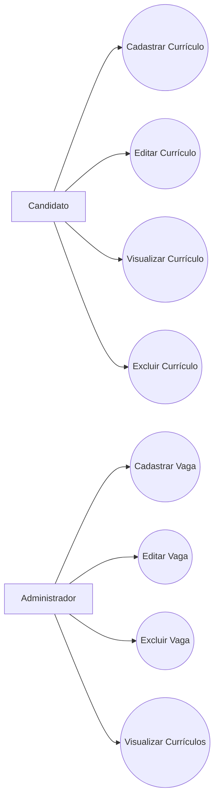
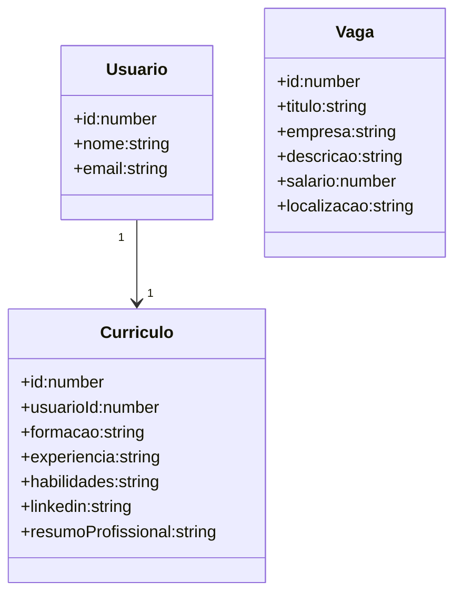
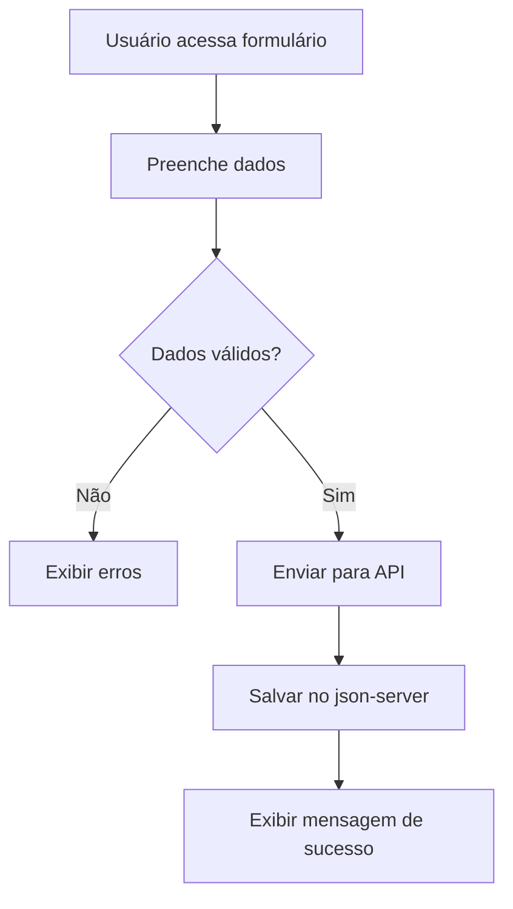
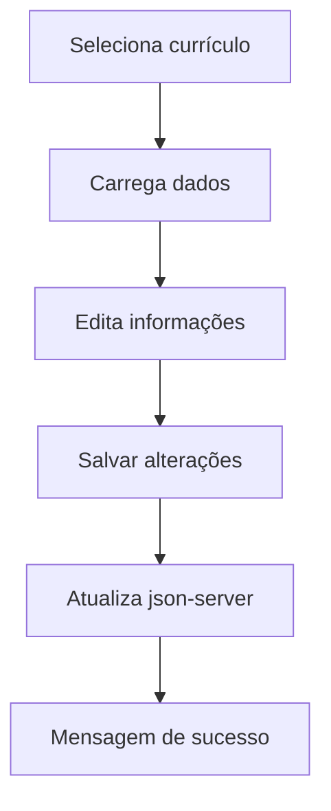

# Especificação de Requisitos de Software (SRS)

**Projeto:** Plataforma RH
**Versão:** 1.0
**Data:** 02 de Junho de 2026

---

# 1. Introdução

## 1.1 Propósito

Este documento descreve os requisitos funcionais e não funcionais da Plataforma RH, contemplando os módulos de Vagas e Currículos. O sistema tem como objetivo permitir que candidatos cadastrem e gerenciem seus currículos profissionais, candidatem-se a vagas e que administradores realizem o gerenciamento das informações cadastradas.

## 1.2 Escopo

A Plataforma RH será desenvolvida utilizando Angular para o frontend e json-server como backend simulado.

O sistema permitirá:

* Cadastro e autenticação simulada de usuários;
* Cadastro, edição, visualização e exclusão de currículos;
* Cadastro, edição, visualização e exclusão de vagas;
* Associação de currículos aos usuários cadastrados;
* Visualização de currículos por administradores;
* Navegação entre páginas através do Angular Router;
* Persistência de dados utilizando json-server.

---

# 2. Descrição Geral

A Plataforma RH é um sistema web destinado ao gerenciamento de vagas e currículos.

Existem dois perfis de acesso:

### Candidato

Responsável por cadastrar e manter atualizado seu currículo profissional.

### Administrador

Responsável por gerenciar vagas e visualizar os currículos cadastrados pelos candidatos.

O sistema utiliza uma API REST simulada através do json-server para armazenamento e recuperação das informações.

---

# 3. Requisitos do Sistema

## 3.1 Requisitos Funcionais (RF)

### RF01 – Cadastro de Currículo

O sistema deve permitir que o candidato cadastre um currículo contendo:

* Formação acadêmica;
* Experiência profissional;
* Habilidades;
* LinkedIn;
* Resumo profissional.

### RF02 – Visualização de Currículo

O sistema deve permitir que o usuário visualize seu currículo cadastrado.

### RF03 – Edição de Currículo

O sistema deve permitir que o usuário altere informações previamente cadastradas em seu currículo.

### RF04 – Exclusão de Currículo

O sistema deve permitir a exclusão de um currículo existente.

### RF05 – Vinculação ao Usuário

O currículo deve estar associado ao identificador do usuário (usuarioId).

### RF06 – Listagem de Currículos

O sistema deve permitir que administradores visualizem a lista de currículos cadastrados.

### RF07 – Cadastro de Vagas

O sistema deve permitir o cadastro de vagas de emprego.

### RF08 – Edição de Vagas

O sistema deve permitir a atualização das informações das vagas.

### RF09 – Exclusão de Vagas

O sistema deve permitir a remoção de vagas cadastradas.

### RF10 – Consulta de Vagas

O sistema deve exibir a listagem de vagas disponíveis.

### RF11 – Navegação por Rotas

O sistema deve disponibilizar as seguintes rotas:

| Rota                   | Descrição                 |
| ---------------------- | ------------------------- |
| /curriculos/novo       | Cadastro de currículo     |
| /curriculos/editar/:id | Edição de currículo       |
| /meu-curriculo         | Visualização do currículo |
| /vagas                 | Listagem de vagas         |
| /vagas/nova            | Cadastro de vaga          |

### RF12 – Feedback ao Usuário

O sistema deve exibir mensagens de sucesso ou erro após operações CRUD.

---

## 3.2 Requisitos Não Funcionais (RNF)

### RNF01 – Tecnologia Frontend

O sistema deverá ser desenvolvido utilizando Angular.

### RNF02 – Backend Simulado

Os dados deverão ser armazenados utilizando json-server.

### RNF03 – Responsividade

A interface deverá adaptar-se a diferentes tamanhos de tela.

### RNF04 – Usabilidade

O sistema deverá apresentar navegação intuitiva e simples.

### RNF05 – Performance

As operações de consulta deverão ocorrer em até 2 segundos em ambiente local.

### RNF06 – Manutenibilidade

O código deverá seguir boas práticas de componentização e reutilização.

### RNF07 – Validação

Os formulários deverão validar campos obrigatórios antes do envio.

### RNF08 – Segurança Simulada

Os dados deverão ser vinculados ao usuário autenticado de forma simulada através do usuarioId.

---

# 4. Interface de Dados e Modelagem do Sistema

## 4.1 Estrutura do Currículo

```typescript
export interface Curriculo {
  id?: number;
  usuarioId: number;
  formacao: string;
  experiencia: string;
  habilidades: string;
  linkedin: string;
  resumoProfissional: string;
}
```

## 4.2 Estrutura da Vaga

```typescript
export interface Vaga {
  id?: number;
  titulo: string;
  empresa: string;
  descricao: string;
  salario: number;
  localizacao: string;
}
```

---

# 4.1 Diagramas

## 4.1.1 Diagrama de Caso de Uso



---

## 4.1.2 Diagrama de Classes



---

## 4.1.3 Diagrama de Fluxo

### Cadastro de Currículo



### Edição de Currículo



---

# 5. Critérios de Aceitação

### CA01 – Cadastro

O sistema deve permitir cadastrar um currículo com todos os campos obrigatórios preenchidos.

### CA02 – Edição

O usuário deve conseguir atualizar informações do currículo.

### CA03 – Exclusão

O sistema deve remover corretamente um currículo do banco simulado.

### CA04 – Visualização

O usuário deve visualizar seus dados cadastrados de forma organizada.

### CA05 – Listagem Administrativa

O administrador deve conseguir visualizar todos os currículos cadastrados.

### CA06 – Navegação

Todas as rotas devem funcionar sem erros.

### CA07 – Feedback

O sistema deve exibir mensagens de sucesso ou falha após operações CRUD.

### CA08 – Persistência

Os dados exibidos devem corresponder exatamente aos registros armazenados no db.json.

---

# 6. Configuração do Ambiente

## Requisitos

* Node.js instalado
* Angular CLI instalado globalmente
* json-server instalado globalmente
* VS Code ou IDE compatível

## Instalação

### Instalar Angular CLI

```bash
npm install -g @angular/cli
```

### Instalar json-server

```bash
npm install -g json-server
```

### Instalar dependências do projeto

```bash
npm install
```

### Executar Angular

```bash
ng serve
```

### Executar json-server

```bash
json-server --watch db.json --port 3000
```

### URLs do Sistema

Frontend:

```text
http://localhost:4200
```

Backend Simulado:

```text
http://localhost:3009
```

---

# 7. Tecnologias Utilizadas

* Angular 20+
* TypeScript
* Angular Router
* Reactive Forms
* Angular Material
* RxJS
* json-server
* HTML5
* CSS3

---

# 8. Conclusão

A implementação do módulo de Currículos amplia as funcionalidades da Plataforma RH, permitindo o gerenciamento completo das informações profissionais dos candidatos através de operações CRUD, integração com API REST simulada e utilização das principais funcionalidades do framework Angular.
